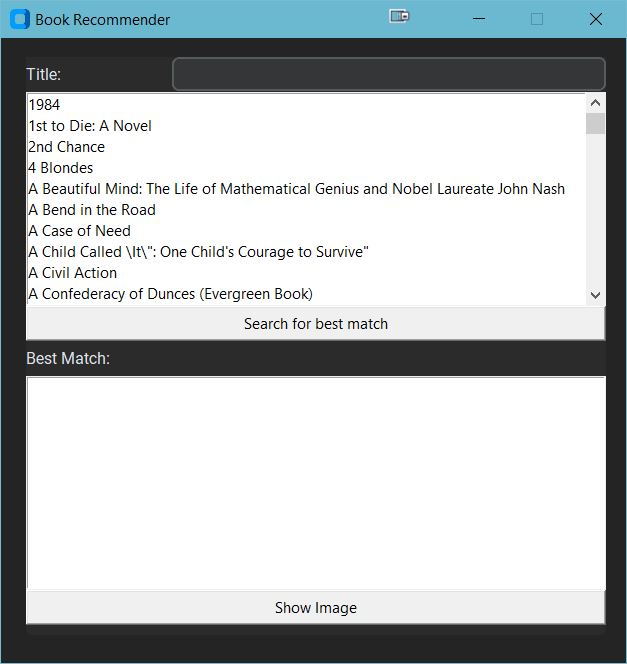
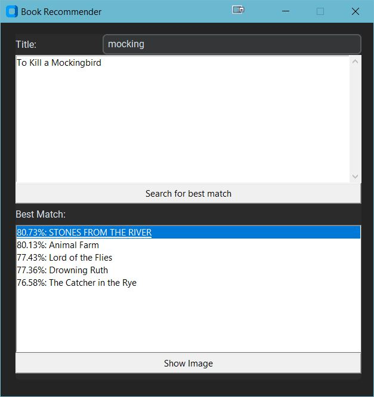
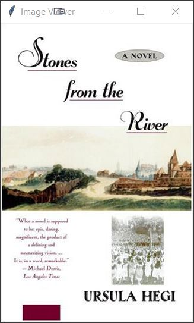

# Book_Recommendation

This is a book recommender that uses over 271 000 books (before cleaning the data). The data is from the Institute für Informatik Freiburg: http://www2.informatik.uni-freiburg.de/~cziegler/BX/
It is a KNN model that shows the top 5 book recommendations depending on the chosen book.

You can scroll or search to find a book that you liked. Then you click "Search for best match" to get the top 5 recommendations from people that liked that book.

There are so many books in the world that a lot of titles are used multiple times. If you are unsure which book is recommended, then you can use the "Show Image" button. This will make the cover of the selected book pop up in a new window.

 
